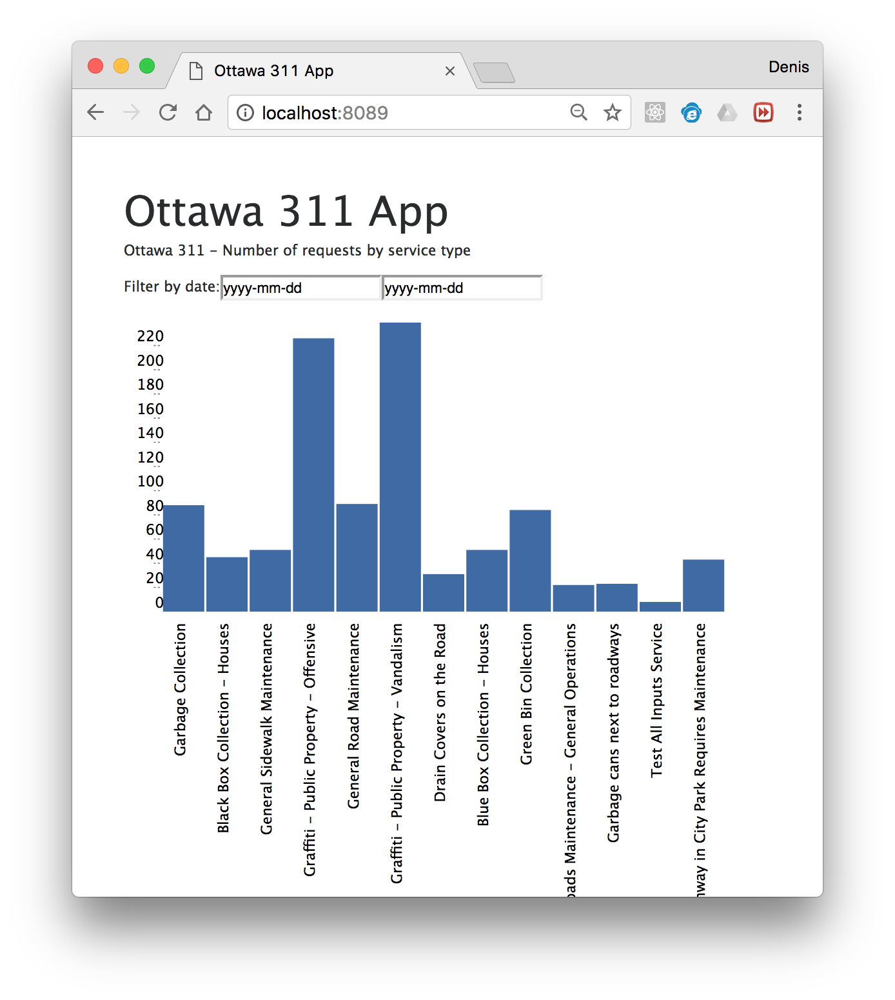

# PotHole WebServer

An app that receives a photo from a client app and sends a request to the City of Ottawa for pot hole repair.

## Quickstart

To quickly get a development server up and running, we are going to be using [Docker](https://docs.docker.com/engine/installation/) & [Docker Compose](https://docs.docker.com/compose/install/) to set up our `pothole webserver` online.

```
$ git clone git@github.com:YOWCT/pothole_webserver.git
$ cd pothole_webserver
$ docker-compose build
$ docker-compose up

pothole    | > pothole_webserver@0.0.0 prestart /usr/src/app
pothole    | > jsdoc services/index.js -d public/docs
pothole    |
pothole    | npm info lifecycle pothole_webserver@0.0.0~start: pothole_webserver@0.0.0
pothole    |
pothole    | > pothole_webserver@0.0.0 start /usr/src/app
pothole    | > node ./bin/www
pothole    |
pothole    | server running on port: 8089
```

Using your favorite web browser visit [`http://localhost:8089`](http://localhost:8089).



## Full Install

### Install Dependencies

You must first install all dependencies using the [latest version of NodeJS](https://nodejs.org/en/).

```bash
$ git clone git@github.com:YOWCT/pothole_webserver.git
$ cd pothole_webserver
$ npm install
```

### Set up Database

One of the easiest way to set up [MongoDB](https://www.mongodb.com/) is via a Docker container.

More information here: https://hub.docker.com/_/mongo/

**Docker Compose (start/stop)**

```bash
$ docker-compose build
$ docker-compose up mongodb

$ docker-compose start mongodb
Starting mongodb ... done

$ docker-compose stop mongodb
Stopping mongodb ... done
```

**Docker (start/stop)**

```bash
$ docker run -d --name mongodb -p 27017:27017 mongo
da99aabd553b1c69c907068eea0f32329b47ad447000cc3204db27061f92673c

$ docker stop mongodb
mongodb
```

### Environment Variables

Add these variables in a file called `.env`.

```env
KEY_PATH=key.pem
CERT_PATH=cert.pem
LOCAL=127.0.0.1
PRODUCTION=prod_ip
DOMAIN=https://example.com
PORT=8089
DB_USER=db_user
DB_HOST=db_ip_or_url
DB_PASS=password
MAILGUN_KEY=key-api_key
FROM_EMAIL=ott311@esdev.xyz
```

### Start Server

```bash
$ npm start

> pothole_webserver@0.0.0 prestart /Users/mac/Github/pothole_webserver
> jsdoc services/index.js -d public/docs


> pothole_webserver@0.0.0 start /Users/mac/Github/pothole_webserver
> node ./bin/www

server running on port: 8089
```

Using your favorite web browser visit [`http://localhost:8089`](http://localhost:8089).

## References

### Open 311 Docs
- http://wiki.open311.org/GeoReport_v2/#post-service-request
- http://data.ottawa.ca/en/dataset/open311

### Open 311 Endpoints
- https://city-of-ottawa-dev.apigee.net/open311/v2/requests.json

### Open 311 Post Request

```http
POST /dev/v2/requests.xml
Host: api.city.gov
Content-Type: application/x-www-form-urlencoded; charset=utf-8

api_key=xyz&jurisdiction_id=city.gov&service_code=001&lat=37.76524078&long=-122.4212043&address_string=1234+5th+street&email=smit333%40sfgov.edu&device_id=tt222111&account_id=123456&first_name=john&last_name=smith&phone=111111111&description=A+large+sinkhole+is+destroying+the+street&media_url=http%3A%2F%2Ffarm3.static.flickr.com%2F2002%2F2212426634_5ed477a060.jpg&attribute[WHISPAWN]=123456&attribute[WHISDORN]=COISL001
```

### Useful docs

**Deploy using Heroku**

- https://devcenter.heroku.com/articles/local-development-with-docker-compose
- https://devcenter.heroku.com/articles/container-registry-and-runtime

**Host Images**

- https://medium.com/@adinugroho/upload-image-from-ios-app-using-alamofire-ecc6ad7fccc
- https://github.com/expressjs/multer/blob/master/StorageEngine.md

** IOS **

- https://youtu.be/zAWO9rldyUE
